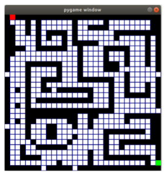
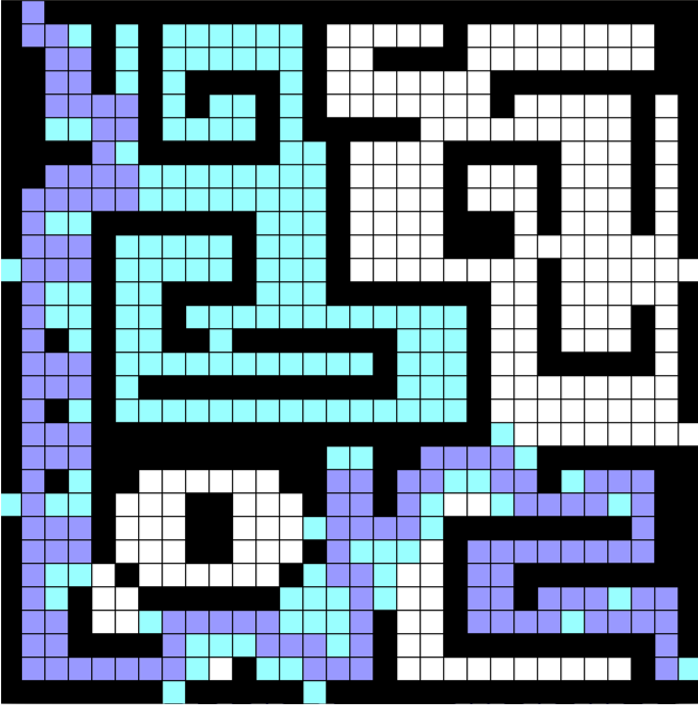
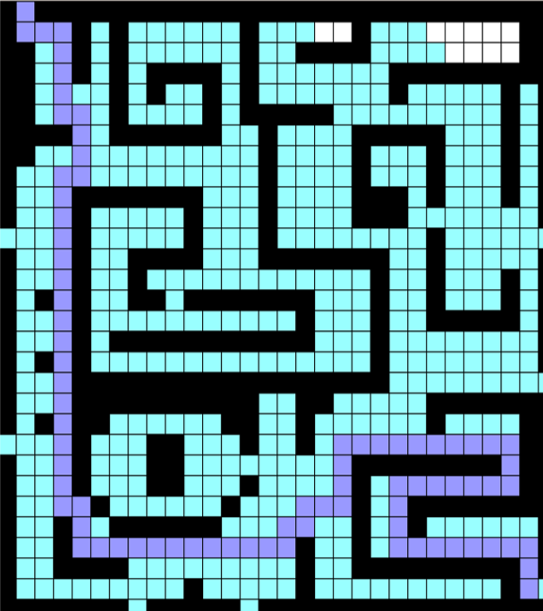
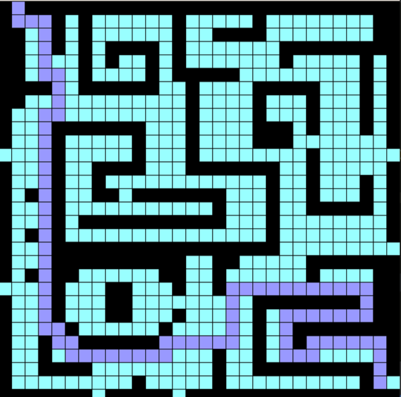

# Uniform Search

Create a window that shows the following maze of 30x30. You can find the data that represents the maze and the cost of each cell in the file maze.txt

  

The red cell represents the star state, with coordinates (0,1). The green cell is the goal at (28,29).

Implement the DFS, BFS and uniform cost search algorithms. As in the class notebook, the util.py has some data structures than can be useful to implement in the same function the three search algorithms, like queues, stacks and priority queues. The search.py allows you the inherit the class SearchProblem so you can define your own with the same functions.

DFS (Depth First Search)
==============================================

  

- The amount of explored states is: 277.
- Cost of the path is:  1446.
- Elapsed time: 0.337 seconds.

BFS (Breadth First Search)
==============================================

  

- The amount of explored states is: 520.
- Cost of the path is:  840.
- Elapsed time: 0.461 seconds.

UCS (Uniform cost search)
==============================================

  

- The amount of explored states is: 535.
- Cost of the path is:  782.
- Elapsed time: 0.0378 seconds.

## Which algorithm was the best for solving the maze problem?

The best algorithm for the problem solution is Uniform Cost Search what this algorithm find the solution in a short time because your time is 10 times more little that DFS and 12 times more little that BFS and have the most little cost but this solution explore almost all nodes of maze. In terms of algorithm that not see the cost, the best algorithm for the problrem solution of maze is Breath First Search wich tis find the path with short numbers of actions from leave to the goal state although the algorithm  explorer most nodes of maze.
